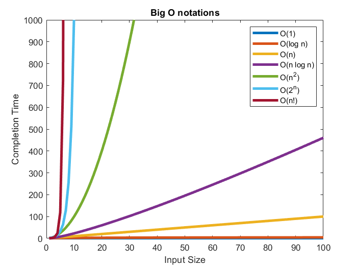

(content:otherperformance)=
# Other performance measures

## Computational Complexity

On an application level, speech processing algorithms are usually used
on low-resource devices like mobile phones. Mobile devices have limited
computational capabilities, so it
is important to design efficient algorithms for them to preserve their battery. There are multiple
ways of analyzing the computational complexity of an algorithm depending
on the stage of the design process or the purpose of the final
application:

  

### Big-O notation:

  

The complexity of an algorithm is usually understood as a measurement of
the time that an algorithm would take to complete, given an input of
size n. When the input size grows, the computing time should
remain within a practical bound. For this reason, complexity is measured
asymptotically as n approaches infinity. The most popular representation
of algorithmic complexity is the Big-O notation. The Big-O notation
gives an upper bound to the growth of the computing time of an
algorithm. This proves especially useful because this notation allows
us to compare algorithms in worst-case scenarios. Figure 1 shows the
growth rate of different Big-O notations with respect to the input size.

For example, a complexity of O(n), read as "O n complexity', represents
an algorithm whose computation time grows linearly with the input size.
Some examples of every type of complexity are:

  

-   O(1) - The computation time does not grow with the size of the
    input:  
    -   Accessing an array index (a = array\[4\]).  
          
-   O(log n) - The computation time grows with the logarithm of the
    input size:
    -   Binary Search algorithms.  
          
-   O(n) - The computation time grows linearly with the input size:
    -   Traversing an array.
    -   Comparing two strings.  
          
-   O(n2) - The computation time grows with the square of the
    input size:
    -   Matrix operations like traversing a 2D array or multiplying a 1D
        array with a 2D matrix.
    -   Conventional Discrete Fourier Transform (Matrix
        multiplication).  
          
-   O(n log n) - The "log n" term is added when O(n2)
    algorithms are performed with divide-and-conquer techniques to
    increase their efficiency.
    -   Fast Fourier Transform.  
          
-   O(2n) - The computation time doubles with each addition
    to the input data, therefore it grows exponentially:
    -   Recursive algorithms → To solve a problem of size N, it is
        necessary to solve two problems of size N - 1.  
          
-   O(n!) - Factorial growth represents algorithms that grow even faster
    than exponential examples:
    -   Finding all the possible permutations of a list.

  

  

### Weighted Million Operations Per Second (WMOPS),  [ ITU-T. Software tool library: User’s manual, 2009 ](https://www.itu.int/rec/T-REC-G.191-200911-S/en)

  

The Big-O notations give us an intuitive idea of the complexity of
specific algorithms. This allows us to compare which algorithm to use
and choose the most efficient option. However, in applications like
speech coding, it is important to know the exact number of operations
the system needs to perform to process each audio frame.

The ITU-T provides guidelines to measure the number of operations in a
program. This measurement considers that not all the operations
have the same computational load and scales their values accordingly.
For example, a logarithm is a much heavier operation than an addition.
The final result is represented as Weighed Million Operations Per Second
(WMOPS). Table 1 shows the weights used for each specific operation
carried out.

  

  

  

  

**Figure 1:** Evolution of computation time for multiple Big-O notations
dependent on the input size.

  

  

  

|                           |                                |                                           |
|:----------------------:|:------------------------:|:---------------------:|
|         Operation         |            Example             |                  Weight                   |
|         Addition          |           a = b + c            |                     1                     |
|      Multiplication       |           a = b ∗ c            |                     1                     |
| Multiplication + addition |           a+ = b ∗ c           |                     1                     |
|           Move            |             a = b              |                     1                     |
|      Store in array       |    a\[i\] = b\[i\] + c\[i\]    |                     1                     |
|          Logical          |         AND, OR, etc.          |                     1                     |
|           Shift           |          a = b \>\> c          |                     1                     |
|          Branch           |         if, if...else          |                     4                     |
|         Division          |            a = b/c             |                    18                     |
|        Square-root        |          a = sqrt(b)           |                    10                     |
|      Transcendental       |       sine, arctan, etc.       |                    25                     |
|       Function call       |       a = func(b, c, d)        | 2 + number of arguments passed and returned |
|    Loop initialization    |           for(i=0;i            |                     3                     |
|    Indirect addressing    |            a = b.c             |                     2                     |
|  Pointer initialization   |             a\[i\]             |                     1                     |
|        Exponential        |            pow, en             |                    25                     |
|         Logarithm         |              log               |                    25                     |
|     Conditional test      | used in conjunction with BRANCH |                     2                     |

**Table 1:** Operations accounted by the WMOPS tool and their relative
weight.
