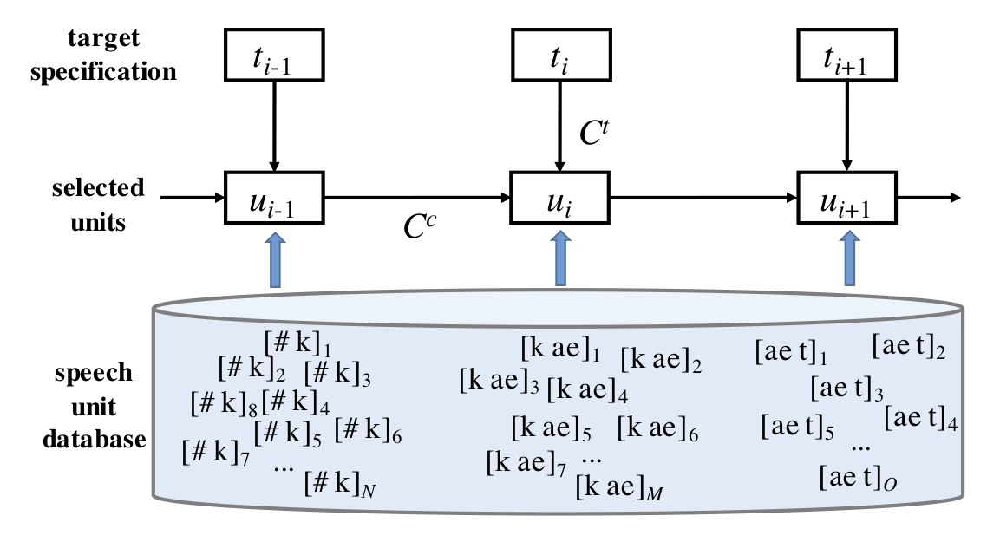
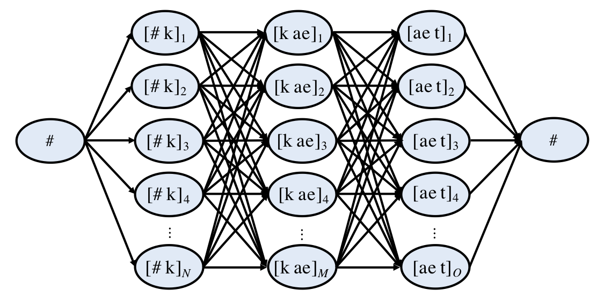

# Concatenative speech synthesis

*Concantenative speech synthesis* (CSS), also known as *unit selection
speech synthesis*, is one of the two primary modern speech synthesis
techniques together with [statistical parametric speech
synthesis](Statistical_parametric_speech_synthesis). As the name
suggests, CSS is based on concatenation of pre-recorded speech segments
in order to create intelligible high-quality speech. The advantage of
this approach is extremely high naturalness of the produced speech, as
long as the system is well-designed and suitable speech data are
available for its development. The drawback is limited flexibility as
all the used speech segments have to be pre-recorded, limiting the
choice of speaker voices or other modifications to the verbal
expression.

The most simple CSS system imaginable could be developed using
concatenation of pre-recorded word waveforms. However, as {cite}`rabiner2007introduction` note, such an approach would suffer from two primary
problems. First, concatenation of word-level waveforms would sound
unnatural, as coarticulatory effects between words would be absent from
the data. In addition, the system would be limited to very restrictive
scenarios only, as there can be tens or hundreds of thousands of lexical
items and millions of proper names in any language—way more than what
can be reasonably pre-recorded by any individual speaker. The problem is
even worse for agglutinative languages such as Finnish, where word
meanings are constructed and adjusted by extending word root forms with
various suffixes. Since words can also participate to utterances in
various positions and roles, prosodic characteristics (e.g., F0) of the
same word can differ from context to another. This means that
pre-recording all possible words is not a practical option.

To solve the issues of scalability and coarticulation, practical modern
CSS systems are based on sub-word units. In principle, there are only
few phones per language (e.g., around 40–50 for English), but their
acoustic characteristics are also highly dependent on the surrounding
context due to coarticulation. Context-dependent phones such as diphones
(pairs of phones) or triphones (phone triplets) are therefore utilized.
In order to build a CSS system, speech dataset has to be first carefully
annotated and segmented for the units of interest. These segments can
then be stored as acoustic parameters (e.g., speech codec parameters) to
save space and to allow easy characterization and manipulation.

### Steps of concatenative synthesis

Once a database of units exists, synthesis with CSS consists of the
following basic steps: **1)** *conversion of input text to a target
specification*, which includes the string of phones to be synthesized
together with additional prosodic specifications such as pitch,
duration, and power, **2)** *unit selection* for each phone segment
according to the specification, and **3)** *post-processing* to reduce
the impact of potential concatenation artefacts.

While the text processing stage is largely similar to pre-processing in
[statistical parametric speech synthesis systems](Statistical_parametric_speech_synthesis), the main part of CSS
is to perform unit selection in such a manner that the output speech
matches the specification with high naturalness of the sound. As
described by {cite}`hunt1996unit`, unit selection is achieved by cost
minimization using two cost functions (Fig. 1): *target cost*
$C^{t}(u_{i},t_{i})$ and *concatenation cost*
$C^{c}(u_{i-1},u_{i})$. Target cost
describes the mismatch between the target speech unit specification
$t_{i}$ and a candidate unit $u_{i}$ from the database.
Concatenation cost describes the mismatch (e.g., acoustic or perceptual)
of the join between the candidate unit $u_{i}$ and the preceding
unit $u_{i-1}$. In other words, an ideal solution
would find all the target units according to the specification without
introducing acoustic mismatches at the edges of concatenated units.

  


Figure 1: An illustration of the selection cost Ct and concenation cost Cc in diphone-based unit selection for synthesis of word "cat" [k ae t]. In practice, diphones with different initial phones but similar coarticulatory effects on the target phone can be considered in the selection process to overcome the issue of data sparsity. Adapted from {cite}`hunt1996unit`.

  

Since the target specification consists of many characteristics such as
target and context phone(s) identity, pitch, duration, and power, the
target cost can be divided into multiple subcosts $j$ as 
 $ C_{j}^{t}(t_{i},u_{i}) $ . For instance, the contextual
phone(s) (e.g., [ae] in the last unit [ae t] of "cat" in Fig. 1) can
be represented by a number of features describing the manner and place
of articulation, so that the specification can be compared to different
candidate units in the database {cite:p}`hunt1996unit`. This enables the
use of different context phones with similar coarticulatory effects on
the target phone. Similarly, costs for segment power and pitch can be
measured, e.g., in terms of the differences in mean log-power and mean
F0. Cost for the target phone ([t] in [ae t] of Fig. 1) is usually a
binary indicator that forces the phonemic identity of the chosen unit to
match with that of the target specification. The total cost can then be
written as

$$
C^{t}(t_i,u_i)=\sum_{j=1}^{P}w_{j}^{t}C_{j}^{t}(t_{j},u_{i}) $$

       (1) 

where $w^{t} = [w^{t}_{1},
w^{t}_{2}, ..., w^{t}_{P}]$ are the
relative weights of each subcost.

Concatenation cost $C^{c}(u_{i-1},u_{i})$
can be derived in a similar manner to Eq. (1) by decomposing the the
total cost to $Q$ subcosts, and then calculating a weighted sum of the
subcosts:

$$
C^{c}(u_{i-1},u_i)=\sum_{j=1}^{Q}w_{j}^{c}C_{j}^{c}(u_{i-1},u_{i})
$$         

(2)

  

Note that the subcosts and their weights $w^{c}$ for
$C^{c}$ do not need match those of $C^{t}$, as the
concatenation cost specifically focuses on the acoustic compatibility of
the subsequent units. Therefore
subcosts  $C^{c}_{j}(u_{i-1},u_{i})$
associated with continuity of the spectrum (or cepstrum), segment power,
and pitch in the segment and/or at the concenation point should be
considered.

  

The total cost of the selection process is the sum of the target and
concenation costs across all $n$ units:

$$
                  \begin{split}
C(t_{1}^{n},u_{1}^{n})&=\sum_{i=1}^{n}C^t(t_i,u_i)+\sum_{i=2}^{n}C^c(u_{i-1},u_i)+C^c(\#,u_1)+C^c(u_n,\#)
\\&
                   =
\sum_{i=1}^{n}\sum_{j=1}^{P}w_{j}^{t}C_{j}^{t}(t_{i},u_{i})+\sum_{i=2}^{n}\sum_{j=1}^{Q}w_{j}^{c}C_{j}^{c}(u_{i-1},u_{i})+C^c(\#,u_1)+C^c(u_n,\#)
\end{split}
$$      

(3)

where $ t_{1}^{n} $ are the targets,  $ u_{1}^{n} $ are the
selected units, and \# denotes silence {cite:p}`hunt1996unit`. The two
extra terms stand for transition from preceding silence to the utterance
and from utterance to the trailing silence. The aim of the selection
process is then to find units $ \bar{u}_{1}^{n} $ that minimize
the total cost in Eq. (3). The selection process can be represented as a
fully connected trellis, as shown in Fig. 3, where each edge to a node
has a basic cost of the given node to be chosen (the target cost) and an
additional cost depending on the previous unit (the concatenation cost).
Given the trellis, the optimal selection can be carried out with
*[Viterbi search](https://en.wikipedia.org/wiki/Viterbi_algorithm)*—a
dynamic programming algorithm that calculates the least cost path
through the trellis. To make the search computationally feasible for
large databases, less likely candidates for each target can be pruned
from the trellis. In addition, [*beam
search*](https://en.wikipedia.org/wiki/Beam_search) with only a fixed
number of most likely nodes for each step can be applied for further
speedup.   

  


**Figure 3:** An example of unit selection search trellis for word
"*cat*" [*k ae t*]. Each edge is associated with basic target cost of
the selected unit and concatenation cost dependent on the previous unit.
Adapted from {cite:p}`rabiner2007introduction`

After the speech units have been concatenated to form the intended
utterance, postprocessing techniques can be used to smooth the potential
discontinuities in F0, energy and spectrum at the unit boundaries. Note
that aggressive signal processing based modification of the segments
also often tends to decrease the naturalness of the sound.
Straightforward modification of the segments' acoustic parameters (e.g.
with vocoding) is not therefore a recommended strategy to overcome the
issues of poor unit selection or low quality source data.

### CSS training

The above formulation enables mathematically principled and optimal unit
selection process from a given speech database. However, the synthesis
output is highly dependent on the choice of features and functions used
for the subcosts, and also on the weights chosen for each feature. While
the cost functions and their underlying features can be largely designed
based on knowledge in signal processing and speech processing, the
weights need to be either adjusted through trial and error, or they can
be automatically optimized using some kind of quality criterion.

As examples of automatic weight estimation, {cite}`hunt1996unit` propose
two alternative ways to automatically acquire cost function weights:

1\) Using a [grid
search](https://en.wikipedia.org/wiki/Hyperparameter_optimization#Grid_search)
across different weight values by synthesizing utterances using the
target specifications of held-out utterances from the training database,
and then comparing the synthesized waveform to the real waveform of the
held-out utterance using an objective metric. The weights that lead to
the best overall performance are then chosen.

2\) Using regression models to predict best values for the weight. {cite}`hunt1996unit` report that cepstral distance and power difference
across the concanation point can be used as predictors for reported
perceptual quality of the concatenation in a linear regression model,
and therefore the linear regression weights can be directly used as
perceptually motivated the cost weights.  For the target weights, they
propose and approach where each unit in the database is considered as
the target specification at a time, and $K$ best matching other units
are then searched for the target using an objective distance measure.
Then the sub-costs between the target and the $K$ matches are calculated
and recorded. This process is repeated for all exemplars of the same
phonetic unit in the database, recording the $K\times Q$ subcosts and the
related $K$ distances for each exemplar. Linear regression is then
applied to predict the recorded objective perceptual distances using the
associated sub-costs, linear regression coefficients again revealing the
optimal weights for each of the subcosts. A specific advantage of the
regression approach for subcost weight estimation is that it allows
estimation of phoneme-specific weights for each subcost, as the
perceptually critical cues may differ from a phonetic context to
another.

  

  

## Further reading


```{bibliography}
:filter: docname in docnames
```

  
<!--



-->
