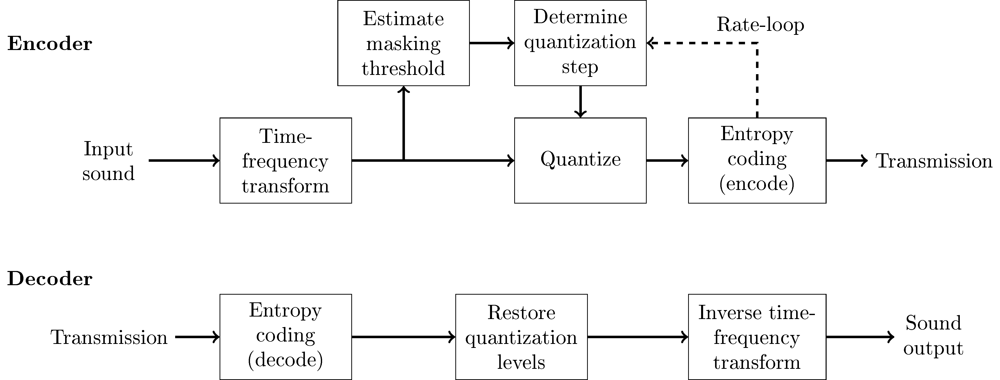

# Frequency-domain coding

In audio coding, the classical approach is based on coding in the
frequency domain, which means that we are coding a [time-frequency
representation](stft) of the signal. Such coding
methods are especially suitable for signals which have prolonged
stationary parts, such as many instrument-sounds, which are often
stationary for the duration of a note, more or less. Frequency-domain
codecs are based on [entropy coding](Entropy_coding) where the
quantization accuracy is chosen with a [perceptual
model](Perceptual_modelling_in_speech_and_audio_coding).

Classical speech coding is however based on [code-excited linear
prediction (CELP)](Code-excited_linear_prediction_CELP), which is a
fundamentally different paradigm. In modern (mobile) applications, these
two modalities, speech and audio are often intertwined and we would like
to be able to encode all types of sounds. For example, a movie can have
music, speech, speech with music in the background, music with spoken
and sung parts, and there are frequent and seamless transitions between
such modalities. For a unified codec, which can encode both speech,
music, generic audio and their mixtures, we therefore needs codecs which
support also frequency-domain coding. Besides, stationary parts of
speech such as fricatives can sometimes be more efficiently encoded with
frequency-domain coding anyway.

Such codecs, which encode both speech, music and generic audio are often
collectively called *speech and audio codecs*. Most recent codecs such
as [MPEG
USAC](https://en.wikipedia.org/wiki/Unified_Speech_and_Audio_Coding),
[3GPP EVS](https://en.wikipedia.org/wiki/Enhanced_Voice_Services) and
[Opus](https://en.wikipedia.org/wiki/Opus_%28audio_format%29) are speech
and audio codecs. Internally, they contain elements of both CELP and
frequency-domain coding and they switch between these modes depending on
the content.

More specifically, frequency-domain codecs are based on a time-frequency
transform such as the [MDCT](Modified_discrete_cosine_transform_MDCT.md),
[perceptual modelling](Perceptual_modelling_in_speech_and_audio_coding)
to choose the quantization accuracy, and [entropy
coding](Entropy_coding) to transmit the quantized signal with the least
amount of bits. At the decoder, the process is reversed (as is obvious).
In many designs, the bitrate is variable, such that with the perceptual
model we choose the desired perceptual accuracy, and entropy coder
compresses that as much as possible. Then we always have approximately
the desired quality, but we however do not in advance know how many bits
we will use. In other designs, we strive for fixed bitrate, such that we
should reach the highest quality as long as the bit-consumption remains
under a chosen limit. With most entropy codecs this means that we have
to implement a *rate-loop*, where we iteratively search for the best
quantization accuracy which remains within the chosen limit on
bit-consumption.

 
